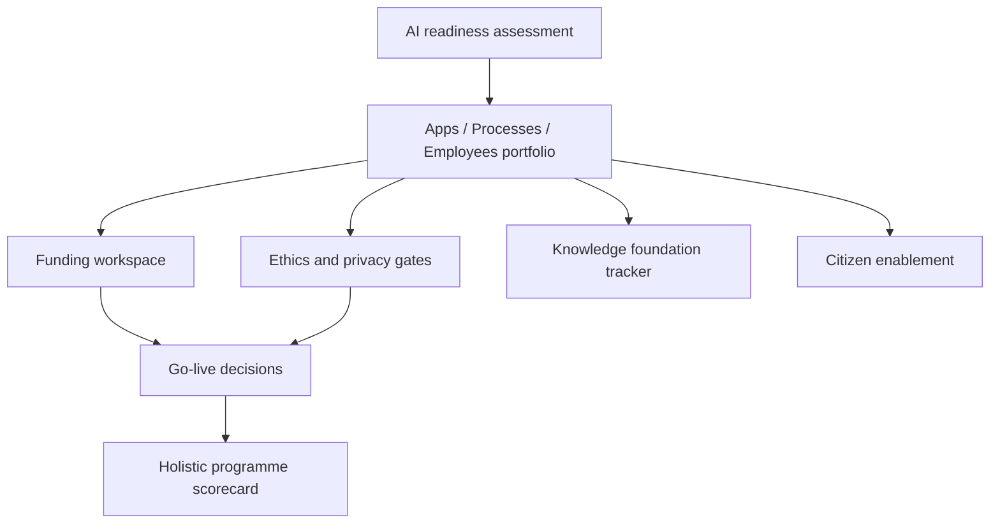

# Everystack

**Source:** `ai-in-enterprise/Microsoft Enterprise AI white paper/`
**Domain:** `ai-enterprise`
**One-liner:** An enterprise AI adoption programme system that plans, funds, and governs AI across every application, every business process, and every employee—so transformation is holistic rather than a pile of single-shingle pilots.
**Wedge:** Global enterprises that have increased AI spend (often planning **>50%** increases) but cannot get strategy, funding justification, and employee-scale adoption aligned—exactly the Gartner obstacles the source names.
**Positioning:** Adoption programme OS. Cloud AI catalogs sell services; Everystack sells the operating model: readiness assessment, portfolio across apps/processes/employees, citizen-data-scientist enablement, knowledge unification, and ethics gates (fairness, reliability, privacy, inclusivity, transparency, accountability).

## Market research synthesis

### Thesis from source

Microsoft’s enterprise AI vision paper opens with scale economics—PwC’s claim that AI lifts global GDP by **14% by 2030** (**$15.7T**)—and executive optimism (EIU: **90%** expect positive growth impact, **86%** productivity, **69%** job creation). Yet the binding constraint is organizational: Gartner lists strategy/goals, project justification, and formal funding as key obstacles, so enterprises stall in limited use cases that “only scratch the surface.” Microsoft’s thesis is **holistic transformation**: AI in **every application**, **every business process**, and **every employee**, with a strategic partner posture rather than isolated tools.

On applications: IDC forecasts **75% of commercial enterprise apps** will use AI by 2021; most app developers lack AI expertise, so progress requires platforms plus trusted pre-built cognitive services, custom model workshops, knowledge mining, and conversational AI. Gartner: **25% of customer service operations** will integrate virtual assistants/chatbots by 2020 (from **<2%** in 2017). On processes: value is proportional to how thoroughly the business is reinvented—Dynamics-style out-of-box AI for sales, service, field service, market insights, plus industry plays (NBA and fraud in financial services; predictive maintenance in manufacturing with Capgemini’s **~20%** productivity on smart factories; retail personalization; public-sector citizen services; healthcare deterioration prediction; education risk analytics). Microsoft’s own ops show concrete gains (e.g., **2×** self-help success from a support virtual agent).

On employees: Gartner estimates AI augmentation generates **$2.9T** business value and recovers **6.2B** worker hours by 2021, and that by **2019 citizen data scientists** will surpass professional data scientists in volume of advanced analysis. The three imperatives are turn disparate data into knowledge (silos + unstructured + ROT), enrich experiences with searchable knowledge, and democratize AI inside everyday workflows. Ethics are first-class: fairness, reliability and safety, privacy and security, inclusivity, transparency, accountability—plus GDPR-oriented privacy and human review for bias. The paper closes with an **AI Ready assessment** that evaluates organizational readiness and recommends appropriate implementations.

Everystack productizes that programme: readiness → three-horizon portfolio (apps, processes, employees) → knowledge foundation → democratized skills → ethics checkpoints → funded roadmap—not another model workbench.

### Buyer & economic model

- **Primary buyer:** Chief Digital Officer, CIO, or Chief AI Officer accountable for enterprise AI strategy and board funding.
- **Users:** AI programme PMO, application owners, process excellence leads, HR/L&D for citizen-data-scientist enablement, security/privacy/ethics reviewers, line leaders in priority industries/functions.
- **Budget owner / value metric:** enterprise AI and transformation budget. Value metric is % of priority apps/processes with production AI, citizen-analyst active usage, funding cycle time from proposal to approval, and ethics-gate pass rate.
- **Competing status quo:** disconnected Cognitive Services pilots, a chatbot vanity project, and a slide “AI strategy” without readiness scoring or employee enablement.

### Domain constraints

- **Regulatory / trust / safety:** GDPR and sector rules; six ethics values must be operationalized, not posterware; healthcare/finance/public sector use cases need heightened controls.
- **Data sensitivity:** unifying siloed and unstructured data into searchable knowledge amplifies access-control and ROT hygiene requirements.
- **Change-management realities:** developers without AI skills need assisted paths; employees adopt AI only inside existing workflows; single-use-case funding habits fight holistic portfolios.

## Business requirements

- BR-1: The programme must maintain a portfolio explicitly partitioned into application, business-process, and employee initiatives with owners and outcome metrics.
- BR-2: An AI readiness assessment must be completable and must gate large funding releases with scored gaps (strategy, data, skills, ethics, operating model).
- BR-3: Application initiatives must declare whether they use pre-built cognitive capabilities, custom models, or conversational agents, and track developer enablement status.
- BR-4: Process initiatives must state the reinvented process KPI (not only cost takeout)—e.g., customer experience, decision quality, downtime—consistent with the source’s Gartner framing.
- BR-5: Employee initiatives must measure citizen-data-scientist adoption and time saved inside productivity workflows, not merely license counts.
- BR-6: A knowledge-foundation workstream must track progress from siloed/unstructured/ROT data to searchable, model-consumable knowledge with access controls.
- BR-7: Every production initiative must pass ethics checkpoints covering fairness, reliability/safety, privacy/security, inclusivity, transparency, and accountability before go-live.
- BR-8: Conversational agents that face customers or employees must define escalation to humans and multi-turn success metrics.
- BR-9: Industry or function playbooks (financial crime, predictive maintenance, personalization, citizen services, clinical risk, student risk) may be selected as templates but must still pass readiness and ethics gates.
- BR-10: Funding requests must include goals, justification, and formal ask artifacts so Gartner’s named obstacles are addressed inside the system.
- BR-11: Security and privacy reviews must record lawful basis, data minimization, and threat considerations for each initiative.
- BR-12: Programme scorecards must show holistic coverage (apps × processes × employees) to prevent regression into single-shingle portfolios.

## User stories

Canonical user stories live in sibling [USER_STORIES.md](USER_STORIES.md).

## System design

### Overview

Everystack is the programme control system for enterprise AI adoption. Organizations run readiness assessments, build a three-pillar portfolio, attach knowledge-foundation and enablement workstreams, and route each initiative through funding and ethics gates. Integrations pull usage from productivity and business apps to prove employee and process adoption. It intentionally stops at the programme API boundary—model training and cloud AI services remain external systems of execution.

### Actors & boundaries

- **Actors:** CAIO/CIO, programme PMO, app and process owners, L&D, knowledge architects, ethics/privacy/security, business sponsors.
- **Trust boundary:** Everystack stores programme, assessment, and gate evidence. Enterprise content and model endpoints stay in existing Microsoft-or-other clouds; Everystack receives scores and metadata.
- **Human-in-the-loop points:** funding approval, ethics exceptions, production go-live, readiness re-score after major org change.

### Core capabilities

1. **AI readiness assessment** — scored gaps and recommended moves.
2. **Three-pillar portfolio** — applications, processes, employees.
3. **Funding workspace** — goals, justification, formal ask, decisions.
4. **Knowledge foundation tracker** — silo/unstructured/ROT → searchable knowledge.
5. **Citizen enablement** — cohorts, skills, workflow adoption.
6. **Conversational programme controls** — channel, escalation, containment KPIs.
7. **Ethics & compliance gates** — six values plus privacy/security evidence.
8. **Industry playbook library** — templates with mandatory gate inheritance.
9. **Holistic scorecards** — coverage and outcome rollups.

### Conceptual data

- **Primary entities:** ReadinessAssessment, Initiative, Pillar, FundingRequest, KnowledgeWorkstream, EnablementCohort, EthicsGate, PrivacyReview, ConversationalAgentProfile, Playbook, ProgrammeScorecard.
- **Critical events:** assessment completed, initiative created, funding approved/denied, ethics passed/failed, knowledge milestone hit, cohort completed, go-live, scorecard published.
- **Retention / audit needs:** funding and ethics decisions retained for multi-year governance; personal learning data minimized; production gate evidence retained per regulated industry policy.

### Integrations (conceptual)

- **Systems of record:** PPM/PMO tools, ITSM, IdP/HRIS, data catalog, cloud AI usage billing, productivity analytics, CRM/ERP process KPIs.
- **Upstream signals:** app inventory, process KPI feeds, training LMS completions, data-quality/ROT scans.
- **Downstream actions:** funding workflows, security review tickets, enablement campaign launches, executive scorecards.

### High-level architecture

### Success metrics

- **Leading:** readiness re-assessment cadence; % initiatives with complete funding artifacts; ethics first-pass rate; citizen cohort active users; knowledge milestone completion.
- **Lagging:** share of priority applications and processes with production AI; employee hours recovered / self-help success lifts; reduction in single-pilot spend share; audit findings on AI ethics/privacy; repeatable funding cycle time.

## OpenAPI skeleton

Canonical HTTP surface lives in sibling [openapi.yaml](openapi.yaml). Summary:

- **Base path:** `/v1/...`
- **Auth:** `X-API-Key` for integrations; Bearer JWT for operators.
- **Resource groups:** Readiness, Initiatives, Funding, Knowledge, Ethics, Scorecards.
