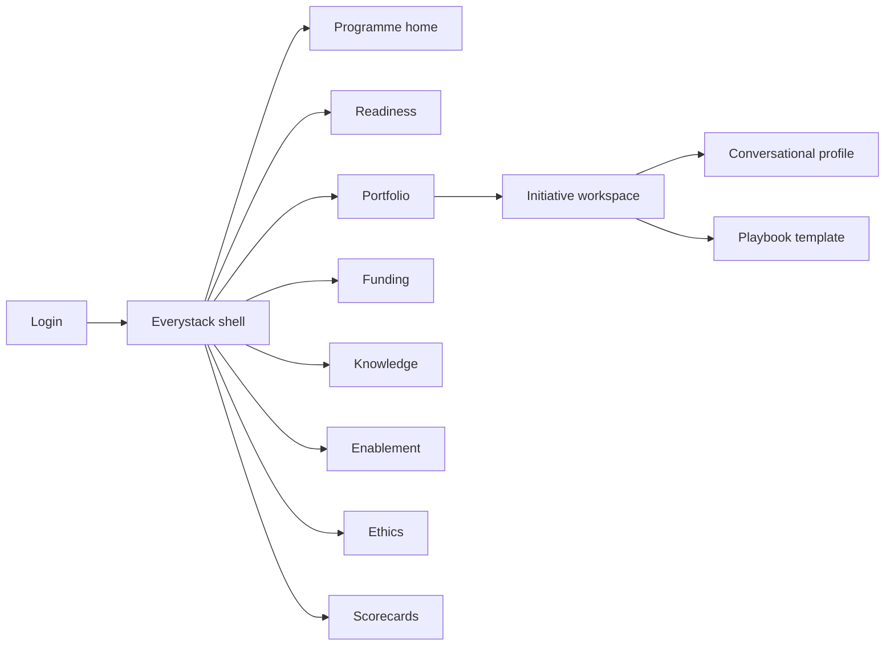
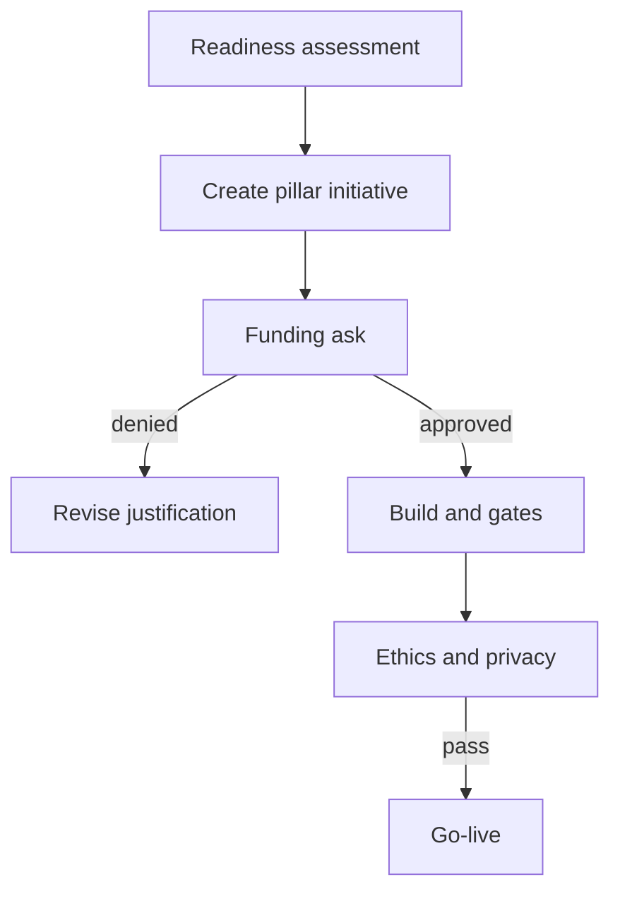

# Everystack — Web app

**Product:** [PRODUCT.md](./PRODUCT.md)
**Primary surface:** Enterprise AI adoption programme console (CAIO / CIO / CDO shell)
**Secondary surfaces:** Ethics review packet (read-only export); citizen enablement cohort portal (lightweight)
**Design thesis:** Everystack is the operating model for AI in every app, every process, and every employee — not a cognitive-services catalog. The UI metaphor is a three-pillar stack: application, process, and employee initiatives share one funding and ethics spine so single-shingle pilots cannot masquerade as transformation. Visual language is clear daylight white with deep azure structure lines and ethics-indigo checkpoints — trustworthy and institutional, never neon “AI everywhere” marketing. Knowledge foundation progress reads as a silo→searchable ladder; readiness scores gate money before ambition slides do.

## UX research synthesis

### Category peers (best-in-class)

- **Microsoft Responsible AI dashboard / Azure AI Studio governance patterns:** Structured fairness, transparency, and human review evidence. Steal: six ethics values as mandatory checkpoint dimensions with evidence upload; reject making model metrics the programme home.
- **ServiceNow AI Control Tower / SPM:** Portfolio + funding + risk gates. Steal: funding artifacts (goals, justification, formal ask) as first-class objects addressing Gartner obstacles; reject ITSM ticket aesthetics for CAIO narrative.
- **WalkMe / Digital Adoption platforms:** In-workflow employee adoption measurement. Steal: citizen-data-scientist active usage inside productivity tools, not license counts; reject celebration gamification for regulated ethics contexts.
- **Collibra knowledge / data literacy programmes:** ROT and silo remediation tracking. Steal: knowledge milestones from unstructured/ROT to searchable/model-consumable; reject full catalog browse as Everystack home.

### Patterns to adopt / reject

- **Adopt:** Three-pillar portfolio; readiness assessment gating large funds; ethics six-value gates; conversational escalation/containment KPIs; knowledge foundation workstream; citizen cohort metrics; industry playbooks that still inherit gates; holistic coverage scorecards.
- **Reject:** Azure SKU picker as strategy UI; chatbot vanity as sole progress; ethics poster without evidence; single-pillar dashboards; purple glow; editable go-live without privacy/security review.

### Trust, density, and workflow constraints from PRODUCT.md

Everystack stores programme metadata and gate evidence, not raw corpora (trust boundary). Ethics must pass before go-live (BR-7). Readiness gates large funding (BR-2). Holistic coverage prevents single-shingle regression (BR-12). Conversational agents need human escalation (BR-8). Privacy records lawful basis and minimization (BR-11).

## Information architecture

### Nav model

### Roles → default home

| Role | Default home | Why |
|------|--------------|-----|
| CAIO / CIO / CDO | Programme home — three-pillar coverage | Holistic vs single-shingle (BR-1, BR-12) |
| Programme PMO | Portfolio | Owners, stages, funding links |
| Application / developer lead | Portfolio filtered to Apps | Capability type + enablement (BR-3) |
| Process excellence | Portfolio filtered to Processes | Reinvented process KPIs (BR-4) |
| L&D / knowledge lead | Enablement / Knowledge | Citizen adoption + ROT (BR-5, BR-6) |
| Ethics / privacy / security | Ethics queue | Gate evidence before go-live (BR-7, BR-11) |
| Business sponsor | Funding requests | Goals, justification, formal ask (BR-10) |

### Cross-links to OpenAPI resources

| Nav area | OpenAPI tags / resources |
|----------|---------------------------|
| Readiness assessments | Readiness |
| Initiatives / portfolio | Initiatives |
| Funding requests / decisions | Funding |
| Knowledge workstreams | Knowledge |
| Ethics gates | Ethics |
| Programme scorecards | Scorecards |

## Screen inventory

### Programme home

- **Purpose:** One composition of apps × processes × employees coverage, readiness posture, ethics backlog, funding cycle time.
- **Entry:** Default for CAIO.
- **Layout regions:** Brand + period; three-pillar coverage chart; readiness gap summary; ethics pending; funding in-flight; alerts (blocked go-lives, ROT milestones overdue).
- **Primary actions:** Open pillar drill; start readiness; publish scorecard.
- **Empty / loading / error:** Empty = run first readiness assessment; loading = skeleton; error = retry with request id.
- **BR / story ties:** BR-1, BR-12.

### Readiness assessment

- **Purpose:** Score strategy, data, skills, ethics, operating-model gaps; gate large funding releases.
- **Entry:** Nav → Readiness; funding gate CTA.
- **Layout regions:** Dimension scores; gap recommendations; historical re-scores; fund-gate status.
- **Primary actions:** Complete assessment; request re-score; attach to funding.
- **Empty / loading / error:** Incomplete dimensions = cannot unlock large fund tranche.
- **BR / story ties:** BR-2.

### Portfolio (three pillars)

- **Purpose:** Maintain initiatives partitioned into application, business-process, and employee with owners and outcomes.
- **Entry:** Nav → Portfolio.
- **Layout regions:** Pillar tabs; initiative table; playbook origin; ethics/funding status chips.
- **Primary actions:** Create initiative; apply playbook; open workspace.
- **Empty / loading / error:** Empty per pillar = playbook starter CTA.
- **BR / story ties:** BR-1, BR-9.

### Initiative workspace

- **Purpose:** Single initiative truth across pillar-specific fields, funding, ethics, knowledge links, enablement.
- **Entry:** From portfolio.
- **Layout regions:** Pillar header; outcome metrics; capability type (apps) or process KPI or cohort link (employees); conversational profile if relevant; gate strip; go-live controls.
- **Primary actions:** Submit funding; submit ethics; go-live when clear.
- **Empty / loading / error:** Missing pillar-required fields = blocking banner.
- **BR / story ties:** BR-3, BR-4, BR-5, BR-8.

### Funding workspace

- **Purpose:** Capture goals, justification, and formal ask — Gartner obstacles inside the product.
- **Entry:** Nav → Funding; initiative CTA.
- **Layout regions:** Ask artifacts; readiness attachment; decision log; cycle-time meter.
- **Primary actions:** Submit ask; approve/deny; request more evidence.
- **Empty / loading / error:** Missing justification = cannot submit.
- **BR / story ties:** BR-10.

### Knowledge foundation tracker

- **Purpose:** Progress siloed/unstructured/ROT data toward searchable, model-consumable knowledge with access controls.
- **Entry:** Nav → Knowledge.
- **Layout regions:** Workstream ladder (silo → remediate ROT → searchable → model-ready); access-control notes; linked initiatives.
- **Primary actions:** Update milestone; flag ROT debt; link catalog scan.
- **Empty / loading / error:** No workstream = create foundation programme.
- **BR / story ties:** BR-6.

### Citizen enablement

- **Purpose:** Cohorts, skills completion, and in-workflow adoption — not license counts.
- **Entry:** Nav → Enablement; employee-pillar initiatives.
- **Layout regions:** Cohort list; completion; active usage in productivity workflows; time-saved estimates.
- **Primary actions:** Launch cohort; sync LMS; export adoption.
- **Empty / loading / error:** No telemetry = connect productivity analytics empty state.
- **BR / story ties:** BR-5.
- **Mobile notes:** Cohort learners may need mobile-friendly lesson links (view-only).

### Conversational agent profile

- **Purpose:** Escalation to humans and multi-turn success/containment metrics for customer or employee bots.
- **Entry:** Initiative when conversational.
- **Layout regions:** Channel; escalation path; containment KPI; stranded-user alerts.
- **Primary actions:** Define escalation; set success metrics; block go-live if missing.
- **Empty / loading / error:** No escalation = ethics/reliability fail.
- **BR / story ties:** BR-8.

### Ethics and privacy gates

- **Purpose:** Fairness, reliability/safety, privacy/security, inclusivity, transparency, accountability — plus lawful basis and minimization.
- **Entry:** Nav → Ethics; go-live prerequisite.
- **Layout regions:** Six-value checklist with evidence; privacy review fields; security threat notes; pass/fail history; exception (audited).
- **Primary actions:** Submit evidence; approve/fail; block go-live.
- **Empty / loading / error:** Incomplete reliability testing = coral block.
- **BR / story ties:** BR-7, BR-11.

### Industry playbook picker

- **Purpose:** Start from financial crime, predictive maintenance, personalization, citizen services, clinical/student risk templates without skipping gates.
- **Entry:** Create initiative → Playbook.
- **Layout regions:** Playbook cards (interaction containers); inherited mandatory gates callout; tailor fields.
- **Primary actions:** Apply playbook; customize; still run readiness/ethics.
- **Empty / loading / error:** N/A.
- **BR / story ties:** BR-9.

### Programme scorecards

- **Purpose:** Holistic coverage and outcomes — prevent regression into pilot piles.
- **Entry:** Nav → Scorecards; home publish.
- **Layout regions:** Coverage matrix apps×processes×employees; outcome rollups; published versions.
- **Primary actions:** Publish; export board pack.
- **Empty / loading / error:** Incomplete pillar data = draft only.
- **BR / story ties:** BR-12.

## Key flows

1. **Fund a holistic initiative** — readiness → create pillar initiative → funding artifacts → ethics path started → approve funds; failure: readiness gaps block large tranche.

2. **Ethics go-live** — six-value evidence → privacy/security → conversational escalation if needed → go-live or block (BR-7, BR-8, BR-11).

3. **Knowledge foundation progress** — inventory silos/ROT → remediate → searchable → link to democratized initiatives (BR-6).

4. **Citizen cohort adoption** — launch cohort → LMS completion → measure in-workflow active use (BR-5).

5. **Holistic scorecard publish** — coverage + outcomes → CAIO publish (BR-12).

## Design system

### Tokens (CSS variables)

- `--color-ink: #142033` — primary text
- `--color-day: #F5F7FA` — app ground
- `--color-panel: #FFFFFF` — panels
- `--color-rule: #D5DCE6` — dividers
- `--color-azure: #1F5EFF` — structure / primary actions (institutional blue, not purple)
- `--color-indigo: #3D4A8F` — ethics checkpoint chrome
- `--color-teal: #1F8A7A` — passed gates / adoption healthy
- `--color-amber: #D4891A` — provisional funding
- `--color-coral: #C4574A` — ethics fail / go-live block
- `--color-brand: #1F5EFF` — Everystack wordmark
- `--font-display: "Sora", sans-serif` — programme titles
- `--font-body: "IBM Plex Sans", sans-serif` — dense forms
- `--font-mono: "IBM Plex Mono", monospace` — gate ids, assessment versions
- `--space-1`…`--space-8`: 4px scale
- `--radius-sm: 4px`; `--radius-md: 8px`
- `--motion-gate: 200ms ease-out` — ethics pass/fail
- `--motion-pillar: 220ms ease-out` — pillar tab crossfade
- `--motion-fund: 180ms ease-out` — funding decision confirm
- Atmosphere: soft daylight wash; azure hairlines; no neural stock imagery.

### Typography & brand

- Sora for programme and pillar names; Plex for tables; mono for gate versions.
- Brand in shell on every funding/ethics view; login: brand + “AI in every app, process, and employee” + one CTA.

### Do / don’t

- **Do:** Show three-pillar coverage always; gate funds on readiness; require six ethics evidences; measure citizen active use; track knowledge milestones.
- **Don’t:** Purple AI marketing; SKU catalog as home; ethics wallpaper without uploads; license-count vanity; single-pilot hero metrics.

### Accessibility & domain trust cues

- Gate status uses text labels + icons + colour.
- Live regions announce ethics failures and funding decisions.
- Focus order: readiness → initiative → funding → ethics → go-live.
- Privacy fields never optional when personal data flagged.

## Component patterns

- **ThreePillarCoverage** — apps × processes × employees matrix.
- **ReadinessScorecard** — dimension gaps with fund gate.
- **FundingAskPacket** — goals, justification, formal ask.
- **EthicsSixValueGate** — fairness through accountability with evidence.
- **KnowledgeLadder** — silo/ROT/searchable/model-ready stages.
- **CitizenCohortMeter** — completion + in-workflow active use.
- **ConversationalEscalationProfile** — human handoff + containment.
- **PlaybookInheritBanner** — templates still require gates.
- **ProgrammeScorecardExport** — holistic board pack.

## Out of scope for v1 web

- Model training notebooks; Azure/AWS resource provisioning UIs; full data catalog; LMS content authoring; native mobile CAIO apps; customer-facing bot runtime; multi-tenant partner white-label.
